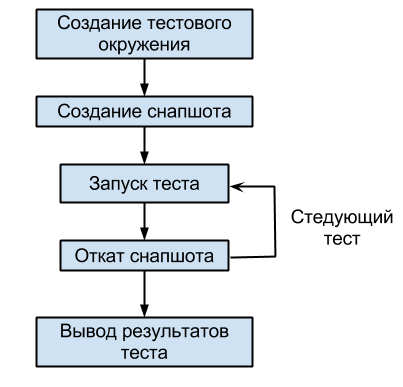
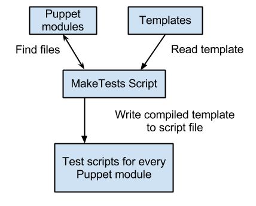

======================
 Integration testing
======================

 Integration testing provides functional testing for one single puppet module or for group of modules.
 You need to prepare special testing manifests in the tests directory for each module.

 These manifests should expose how module can be invoked.
 So they provide not only suite of tests but also good examples how to use this module.

For this tests we should develop scripts to implement testing environment, to tun all this tests and to collect results
 into Jenkins as **xUnit**.

Integration tests provide wider coverage than modular ones.  They check functionality of one or more modules
on required environments. So both code consistency and functionality are tested.

It is easier to create test manifests than to implement  **Rspec** tests. And integration testing is much more useful
 so it is better to focus on it rather than on modular testing.

 Testing algorithm
---------------------

In order to  implement integration testing at first you should create special testing environment.
Then apply the puppet module inside this environment and check the result.

The process of testing can be described by the following steps:

1. Create virtual system from prepared image with supported operating system.
2. Take a snapshot with clean state of operating system so you are able to revert.
3. Run the first test in the testing environment and save the result.
4. Revert to the snapshot with clean state.
5. Run the next test, save the result and revert once again.
6. Collect all the test results as xUnit and put it into Jenkins.

Implementig test
----------------

To implement  integration testing with Jenkins you need to create a set of test scripts for each puppet module.
Each test script should create testing environment and run all the tests for the module.
To simplify creating of such a set of test scripts it is a good idea to utilize the power of templating system.

Рассмотрим схему его работы:

- At first you should prepare the script implementing the aforementioned testing algorithm and make it as template.
- Then use MakeTests script to scan directory containing Puppet modules and find all the test manifests.
- It takes script template expanding paths and names for each module and creating method for running each test manifests.
- All the built scripts are saved in special directory
- The Jenkins' job is created. It should run all the test methods for each script and save the results.

Using MakeTests script
-------------------------------

 MakeTests script has 5 classes:

- **MakeTests** - main class of the script. It provides the program startup, reading and writing of files.
- **PuppetModule** - represents each Puppet module.  MakeTests object creates list of objects for each Puppet module.
- **PuppetTest** -  represents single test. PuppetModule object creates list of these objects for each test manifest.
- **Interface** - auxillary class.  Provides features for error and debug messages output.
- **Color** - auxillary class. For colorizing text output on terminal.

MakeTests accepts the following arguments:

mandatory:
- Path to directory to store the scripts built from templates.
- Path to directory with Puppet modules to be tested.
optional:
- (-m) path to directory with puppet modules on the testing environment. Если тесты создаются на той же самой
  системе, то этот путь будет таким же, как и предыдущий, и его можно не указывать.
- (-t) path to the directory with templates.
- (-f) file with default template
- (-k) keep all the  previous tests

Using templates
----------------------

MakeTests uses the **jinja2** template engine. It uses by default template from **templates** directory.
You can specify another template using the -f option.

В шаблоне можно использовать набор переменных, который передаётся ему скриптом.

**Общие переменные**

- *modules_path* - Путь до модулей Puppet на хост-системе тестирования.
- *local_modules_path* - Путь до модулей Puppet на той системе, где были собраны тесты. Может быть равно modules_path.
- *internal_modules_path* - Путь до модулей Puppet внутри гостевой системы.
- *internal_manifests_path* - Путь до манифестов внутри гостевой системы.
- *tests_directory_path* - Путь до каталога, в который были сохранены файлы тестов.

**PuppetModule**

- *module.name* - Название этого модуля
- *module.path* - Путь до модуля на той системе, гда были собраны тесты
- *module.tests* - Список объектов PuppetTest этого модуля.
- *module.dependencies* - Список модулей, от которых зависит этот модуль

**PuppetTest**

- *test.name* - Название этого теста.
- *test.path* - Путь до этого теста. Относительно корня модуля и не включая имя файла.
- *test.file* - Имя файла этого теста.

Файлы шаблонов могуть включать друг друга, позволяя собирать сложный скрипт из нескольких кусков, которые могут быть
общими для нескольких скриптов. Шаблон может расши рять другой шаблон, заменяя в нём некоторые блоки кода.

В шаблонах можно использовать циклы, условные конструкции, переменные и фильтры. Про использование шаблонизатора
**jinja2** можно узнать больше здесь http://jinja.pocoo.org и в этой документации, которая
хорошо описывает синтаксис, который можно использовать в шаблонах http://jinja.pocoo.org/docs/jinja-docs.pdf

Jenkins
----------------------

http://jenkins-product.srt.mirantis.net:8080/view/puppet_integration/
