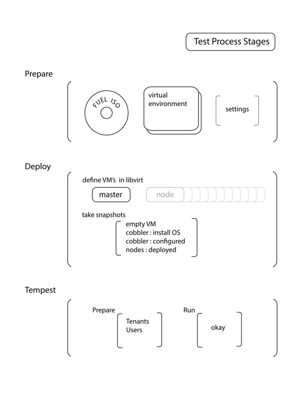

========================================
Системное тестирование -- System Testing
========================================

При системном тестировании проверяется работа всей системы целиком, от установки до функционирования каждого
компонента. Системный тест представляет собой полное развёртывание OpenStack при помощи готового *iso* образа Fuel в
поддерживаемых конфигурациях на опреационныхз системах *CentOS* и *Ubuntu*:

- single
- simple
- minimal
- compact
- full

Схема проведения системного теста:

Prepare Stage
-------------

- fuel-iso -- образ с последней версией Fuel.
    Пример настрок для сбора iso:

    - export USEEXTIF=eth0 - сетевой инетерфейс для загрузки
    - export TGTDRIVE=vda - диск
    - export ISO_URL=http://172.18.67.168/centos-repo/centos-6.4/  -  путь до образа OS
    - export MIRANTIS_MIRROR=http://172.18.67.168/centos-repo/epel-fuel-folsom-2.1/mirror.internal.list - путь до
        каcтомного репозитория

- подготовить virtualenv https://pypi.python.org/pypi/virtualenv. См. Appendix A.
- установить необходимые пакеты, в созданный virtualenv, https://github.com/monroid/fuel-test/blob/master/pip-requires. См. Appendix A.
- выставить настроки для тестируещего скрипта. Для настроек можно использовать либо переменные окружения,
  либо https://github.com/Mirantis/fuel-test/blob/master/settings.py

    Пример переменных окружения для compact deploy:
        - export DEBUG=true
        - export PUPPET_GEN=2
        - export ASTUTE_USE=false
        - export MIRROR_TYPE=default
        - export ISO_IMAGE=/home/jenkins/workspace/fuel_iso_for_tests_srv08/fuel/iso/build/iso/fuel-centos-6.4-x86_64-3.0.iso
        - export CONTROLLERS=3
        - export COMPUTES=3
        - export STORAGES=0
        - export PROXIES=0
        - export QUANTUMS=0
        - export OS_FAMILY=centos
        - export CURRENT_PROFILE=centos64_x86_64

Deploy Stage
------------

Для запуска системного теста необходимо:

    - активировать virtualenv::

        source ./venv/bin/activate

    - запустить необходимый тест::

        nosetests fuel fuel_test.cobbler.test_compact:CompactTestCase.test_deploy_compact_quantum --with-xunit -s -d -l DEBUG

Варианты системных тестов:
    - fuel-test.tests.test_single
    - fuel-test.tests.test_simple
    - fuel-test.tests.test_minimal:MinimalTestCase.test_minimal
    - fuel-test.tests.test_compact:CompactTestCase.test_deploy_compact_quantum
    - fuel-test.tests.test_compact:CompactTestCase.test_deploy_compact_wo_quantum
    - fuel-test.tests.test_quantum_standalone_no_swift:QstTestCase.test_quantum_standalone_no_swift
    - fuel-test.tests.test_full:FullTestCase.test_full

Этапы системного теста:
    - установка os на master
    - настрока *Сobbler* и установка os на управляемые виртуальные машины
    - подготавливаются настройки *Puppet*
    - развёртывание *OpenStack* на всех участвующих в тестировании виртуальных машинах

Успешность развёртывания контролируется путём анализ логов работы *Puppet* агента.

Tempest
-------

Если развёртывание системы произошло без ошибок, то начинается фаза приёмочного тестирования.
При помощи *Tempest* создаются пользователи и квоты. После этого делается попытка запуска облачной
системы на развёрнутом *OpenStack*.

Развертывание считается успешной если все этапы произошли без ошибок. Результат теста возвращается в Jenkins
в формате xUnit и сохраняется.

Jenkins
-------

ISO:
    - http://jenkins-product.srt.mirantis.net:8080/view/fuel-iso/
    - http://jenkins-product.srt.mirantis.net:8080/view/fuel-iso/job/fuel_iso_for_tests_srv07/
    - http://jenkins-product.srt.mirantis.net:8080/view/fuel-iso/job/fuel_iso_for_tests_srv08/
    - http://jenkins-product.srt.mirantis.net:8080/view/fuel-iso/job/fuel_iso_grizzly_msk_for_service

Системные тесты:

    - http://jenkins-product.srt.mirantis.net:8080/view/tempest/
    - http://jenkins-product.srt.mirantis.net:8080/view/tempest/job/grizzly-compact/
    - http://jenkins-product.srt.mirantis.net:8080/view/tempest/job/grizzly-full/
    - http://jenkins-product.srt.mirantis.net:8080/view/tempest/job/grizzly-simple/
    - http://jenkins-product.srt.mirantis.net:8080/view/tempest/job/tempest-grizzly-ubuntu/
