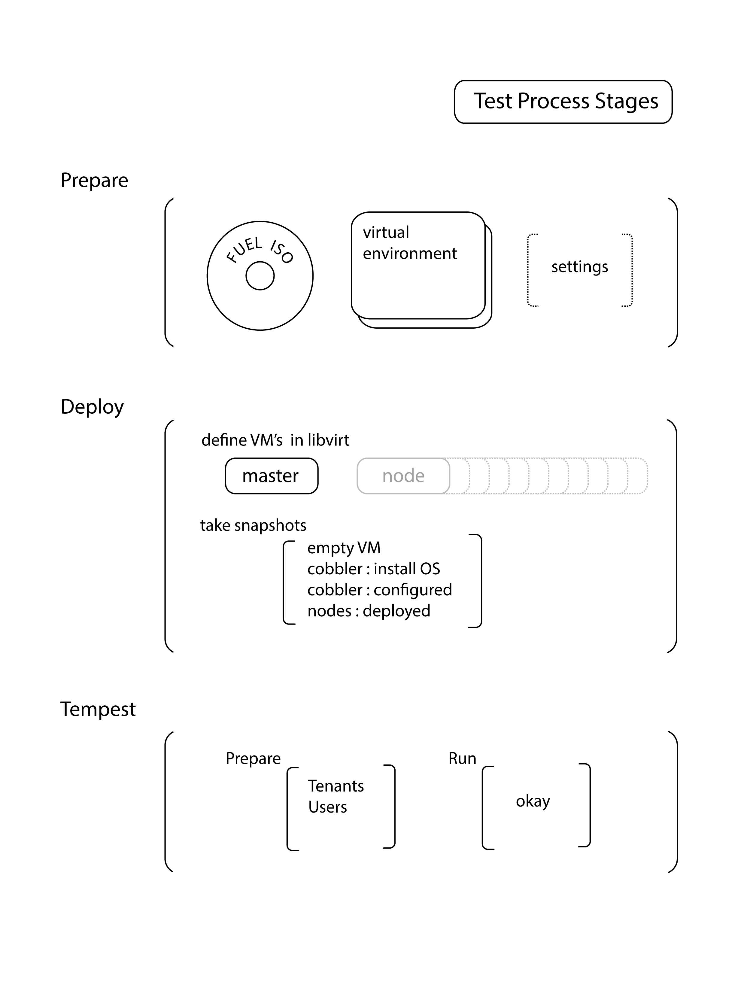

====================
Системные тесты Fuel
====================

Системный тест представляет собой полное развёртывание OpenStack при помощи готового **iso** образа Fuel в
нескольких поддерживаемых конфигурациях на опреационныхз системах *CentOS* и *Ubuntu*.

